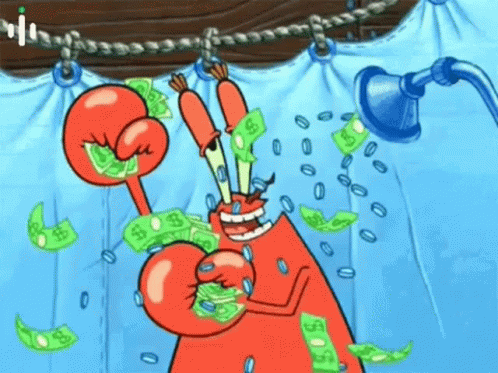

 #   ESPAÑOL:

## <i align="center" style="font-size:2rem">💸 Comparador y Calculador de Divisas con RTK Query</i>

En este proyecto se usaron hooks como **useState,useEffect,useContext** , tenologias como  **HTML,CSS,JavaScript,React,SASS,Bootstrap**, para el manejo de rutas **React Router**, para el manejo de estados **Redux**
y para el manejo de estados asincronos **RTK Query**.

 _Este proyecto fue construido con el proposito de practicar Redux y RTK Query_

**Nota: Es responsivo**

##  💡 Como se penso este proyecto y como funciona

**_Idea Principal : Un comparador y calculador de divisas_**

Nota: Este proyecto ya lo habia realizado previamente en JavaScript Vanilla, asi que tome ideas y lo adapte a React

La api que se utilizo fue : 
- [Currency Converter](https://currency-converter-pro1.p.rapidapi.com')

Lo primero que realice fue dividir la aplicacion en 3 Paginas/Vistas: la pagina Principal, la pagina del comparador de divisas y la pagina del calculador de divisas.

En la vista/pagina Home hay 2 botones : uno para ir al Comparador de divisas y otro para ir al calculador de divisas.

En la vista del Calculador  de Divisas hay 2 componentes principales: Los recuadros de la divisa a calcular y convertida , y el boton de conversion .El boton de realizar la conversion se habilita una vez que se seleccionen las 2 divisas(origen y destino) y se coloque una cantidad . Asi cuando el usuario hace click en el boton de realizar conversion se realiza una peticion con los parametros de la moneda de origen , de destino y la cantidad .

En la vista del Comparador de divisas hay 2 componentes principales: El recuadro de la divisa a comparar y el boton de comparar. El recuadro de la divisa a comparar admite como máximo 3 caracteres (el simbolo de la moneda). Cuando se aprieta el boton de comparar se realiza una peticion a la API  y se envia por parametro la base de la moneda a convertir. Si existe la base enviada traera las diferentes comparaciones con las monedas que posea la api en la base de datos , si es erronea la base o no existe aparecera un cartel en la aplicacion que dire "La moneda no existe".

El manejo del estado lo realice a traves de Redux , donde cree 2 reducers uno para el comparador y otro para el calculador .
El reducer del comparador posee una  accion principal: Cambiar el estado/base que se esta comparando
El reducer del calculador posee tres acciones principales: Cambiar la moneda de origen , cambiar la moneda de destino y cambiar la cantidad.

Para los estilos utilice SASS y Bootstrap , para asi acelerar la construccion del pagina pero al mismo tiempo realizar las personalizaciones pertinentes para poder dejarle un muy buen acabado a la pagina.

------------------------------------------------------------------------------------------
------------------------------------------------------------------------------------------

#  ENGLISH:

## <i align="center" style="font-size:2rem">💹 Currency comparator and calculator with RTK Query</i>

In this project was used hooks like **useState,useEffect,useContext** , technologies like   **HTML,CSS,JavaScript,React,SASS,Bootstrap**, for route management **React Router**, for state management **Redux**
and for asynchronous state management **RTK Query**

 _This project was built with the purpouse of practising Redux and RTK Query_

**Note: It´s responsive**

## 🤔 How this project was thinked and how it works

**_Main Idea : Currency comparator and calculator app_**

Note: I did this project with JavaScript Vanilla so I took some notes to do it in React 

The API used was: 
- [Currency Converter](https://currency-converter-pro1.p.rapidapi.com')

The first I did was split the application in three page/views: Main/Home Page, Comparator Page and Calculator Page.

The Home Page has two buttons: One to go to the Currency Comparator and another to go to the Currency Calculator.

The Calculator Page has two main components: The currency areas (Source,Target) and the conversion button.. The conversion button remains locked until  the user select two currencies and enters the amount.
When user clicks on the  conversion button ,the app will do a fetch to the API sending parameters : currency source, currency target and amount.

The Comparator Page has two main comoponents: The currency source area and the compare button. The currency source area allows three characters as maximum (Currency Symbol) .When user clicks on the compare button ,the app will do a fetch to the API sending the parameter: Currency base .
If it exists then the app will render the differents comparations. If not exists the app will render a message saying : "Currency not exist"

With Redux  i handle the state, where I create two reducers one for the comparator and another for the calculator
The comparator reducer has a main action: Change the state/base of compare.
The calculator reducer has three main actions : Change the source currency , change the target currency and change the amount

For the styles I used SASS and BOOTSTRAP to speed up  the construction  of the page but at the same time to customize the styles.
